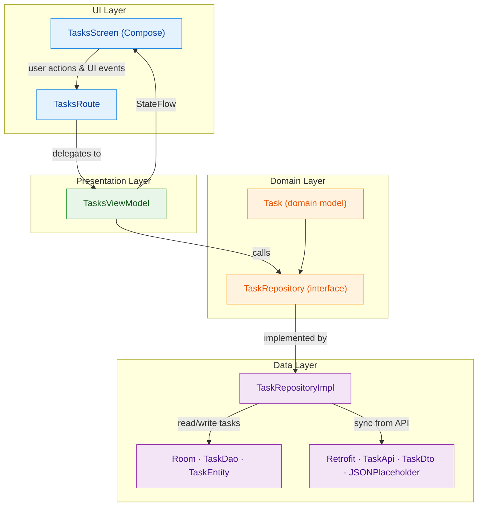

# Android MVVM Template – Compose · Hilt · Room · Retrofit

Production-ready Android template showcasing a modern Kotlin stack:

- **Jetpack Compose** UI with Material 3  
- **MVVM** architecture with unidirectional data flow  
- **Hilt** for dependency injection  
- **Room** for local persistence  
- **Retrofit + OkHttp + Moshi** for networking  
- **Coroutines + Flow** for async & streams  
- **JUnit4 + MockK + Coroutines Test + Turbine** for testing  
- **GitHub Actions CI** for automated builds and tests  

The sample feature is a simple **Tasks** screen that supports:

- Adding local tasks  
- Toggling completion state  
- Deleting tasks  
- Syncing tasks from a **dummy REST API** (`https://jsonplaceholder.typicode.com/todos`) into Room  

This project is designed as a **starting point / portfolio template** for production-style Android apps.

---
## 🧱 Tech Stack

| Area          | Technologies                                                                 |
|---------------|------------------------------------------------------------------------------|
| Core          | Kotlin · Coroutines · Flow                                                   |
| UI            | Jetpack Compose · Material 3 · Navigation Compose                            |
| Architecture  | MVVM · Repository pattern · Feature-first structure                          |
| Data          | Room · Retrofit · OkHttp · Moshi                                             |
| DI            | Hilt                                                                         |
| Testing       | JUnit4 · MockK · kotlinx-coroutines-test · Turbine · Compose UI · Room DAO   |
| Build & CI    | Gradle · GitHub Actions                                                      |


---
### 🧩 MVVM in this project

This template uses the **MVVM (Model–View–ViewModel)** pattern to keep UI, logic, and data clearly separated and easy to test.

- **View (UI – Compose)**  
  Composables like `TasksScreen` only render `TasksUiState` and send user actions (add, toggle, delete, refresh) back to the ViewModel via callbacks. They don’t know about Room, Retrofit, or Hilt.

- **ViewModel**  
  `TasksViewModel` exposes a `StateFlow<TasksUiState>`, collects data from `TaskRepository`, and handles user events using coroutines. It decides *what* the UI should show, but doesn’t know how data is stored or fetched.

- **Model (Domain + Data)**  
  The **Domain** layer defines `Task` and the `TaskRepository` interface.  
  The **Data** layer implements that interface (`TaskRepositoryImpl`) using Room (DAO + entities) and Retrofit (API + DTOs), with mappers converting between DB/network models and domain models.

This structure lets you change the UI, database, or API implementation independently, as long as the contracts (ViewModel + Repository interface) stay the same.  


### High-level component diagram


## 🏗 Project Structure & Architecture

This template follows a **feature-first MVVM** structure with layered responsibilities inside each feature.

**High-level structure:**

```text
app/
 └─ src/main/java/com/example/androidmvvmcomposetemplate/
     ├─ App.kt                  // @HiltAndroidApp
     ├─ MainActivity.kt         // @AndroidEntryPoint host
     │
     ├─ navigation/             // App-wide navigation graph
     │    └─ AppNavHost.kt
     │
     ├─ di/                     // Hilt modules
     │    ├─ DatabaseModule.kt
     │    ├─ NetworkModule.kt
     │    └─ RepositoryModule.kt
     │
     ├─ core/                   // Shared utilities & UI
     │    ├─ data/local/        // AppDatabase, TaskDao, TaskEntity
     │    ├─ ui/theme/          // Colors, Typography, Theme
     │    └─ util/              // Helpers, extensions, etc.
     │
     └─ feature/
          └─ tasks/
              ├─ data/
              │    ├─ remote/       // TaskApi, TaskDto
              │    ├─ mapper/       // TaskEntity <-> Task, TaskDto <-> Task
              │    └─ repository/   // TaskRepositoryImpl
              │
              ├─ domain/
              │    ├─ model/        // Task (domain model)
              │    └─ repository/   // TaskRepository interface
              │
              └─ ui/
                   ├─ TasksUiState.kt
                   ├─ TasksViewModel.kt
                   ├─ TasksScreen.kt   // TasksRoute + TasksScreen + TaskRow
                   └─ components/      // Extra UI components
```

---

## 🔄 Data Flow Explained

This template follows a unidirectional data flow from data sources → ViewModel → UI, with Room as the single source of truth.

1. **UI → ViewModel**
   - Composables (e.g., `TasksScreen`) render a `TasksUiState` exposed by `TasksViewModel`.
   - User interactions (add, toggle, delete, refresh) are converted into events and forwarded to the ViewModel through lambdas.

2. **ViewModel → Domain / Repository**
   - The ViewModel only depends on the `TaskRepository` interface.
   - It calls repository methods in `viewModelScope` coroutines (e.g., add task, toggle completion, delete task, refresh from remote).
   - It subscribes to `TaskRepository.observeTasks()` and maps this data into `TasksUiState`.

3. **Repository → Data Sources (Local + Remote)**
   - `TaskRepositoryImpl` implements `TaskRepository` and coordinates:
     - **Local data** via `TaskDao` / `TaskEntity` (Room).
     - **Remote data** via `TaskApi` / `TaskDto` (Retrofit + Moshi).
   - Network responses are mapped from DTOs to entities and written into Room.
   - The repository never returns raw DTOs or entities to the ViewModel; everything is converted to domain models (`Task`).

4. **Room as Single Source of Truth**
   - The UI does not read directly from the network.
   - All task lists are exposed as a `Flow<List<Task>>` based on `TaskDao.observeTasks()`.
   - Whenever the local database changes (insert, update, delete, or sync from remote), Room emits a new list, the ViewModel updates `TasksUiState`, and the UI recomposes automatically.

5. **Error / Loading Handling**
   - Long-running operations (like refreshing from the remote API) are wrapped in coroutines.
   - The ViewModel updates loading and error fields inside `TasksUiState`, allowing the UI to show progress indicators or error messages without knowing anything about the underlying implementation.


---

## 🚀 Getting Started

### Prerequisites

- Android Studio **Giraffe / Jellyfish / Koala / Narwhal** (or newer)  
- JDK 17  
- Android SDK (API 24+)  
- Git  

### Clone the repo

```bash
git clone https://github.com/onkar-c/Android-MVVM-Compose-Template.git
cd <your-repo>
```

### Open in Android Studio

1. `File` → `Open…`  
2. Select the project folder.  
3. Let Gradle sync.  

### Run the app

1. Choose an emulator or physical device.  
2. Click **Run ▶** in Android Studio.  
3. You should see the **Tasks** screen:
   - Add tasks using the text field + **Add** button.  
   - Toggle completion using the checkbox.  
   - Delete tasks with the trash icon.  
   - Pull tasks from the dummy API using the **Refresh** icon in the top app bar.  

---

## 🌐 Environment & API Configuration

The app uses **JSONPlaceholder** as a dummy backend:

- Base URL: `https://jsonplaceholder.typicode.com/`  
- Endpoint: `GET /todos`  

Configuration is controlled via **BuildConfig** fields in `app/build.gradle.kts`:

```kotlin
defaultConfig {
    // ...
    buildConfigField(
        "String",
        "BASE_URL",
        ""https://jsonplaceholder.typicode.com/""
    )
}

buildTypes {
    getByName("debug") {
        isMinifyEnabled = false
        isShrinkResources = false
        buildConfigField(
            "String",
            "BASE_URL",
            ""https://jsonplaceholder.typicode.com/""
        )
    }

    getByName("release") {
        isMinifyEnabled = true
        isShrinkResources = true
        proguardFiles(
            getDefaultProguardFile("proguard-android-optimize.txt"),
            "proguard-rules.pro"
        )
        buildConfigField(
            "String",
            "BASE_URL",
            ""https://jsonplaceholder.typicode.com/""
        )
    }
}
```

`NetworkModule` uses `BuildConfig.BASE_URL`:

```kotlin
Retrofit.Builder()
    .baseUrl(BuildConfig.BASE_URL)
    .client(okHttpClient)
    .addConverterFactory(MoshiConverterFactory.create(moshi))
    .build()
```

To point to your own API:

1. Change `BASE_URL` in `build.gradle.kts`.  
2. Adjust `TaskDto` and `TaskApi` to match your backend.  

---

## ✅ Testing

This template includes **unit tests** and **instrumented tests**.

### Unit tests (`test/`)

Technologies:

- JUnit4  
- MockK  
- `kotlinx-coroutines-test`  
- Turbine  

Examples:

- `TaskMappersTest` – mapping between `TaskEntity` and `Task`  
- `TaskRepositoryImplTest` – repository behavior with mocked DAO/API  
- `TasksViewModelTest` – ViewModel state updates using a fake repository and `MainDispatcherRule`  

Run all unit tests:

```bash
./gradlew test
```

### Instrumented tests (`androidTest/`)

Technologies:

- Android JUnit4  
- Compose UI testing  
- Room in-memory DB  

Examples:

- `TasksScreenTest` – tests:
  - Empty state text  
  - Text input + Add button behavior  
  - Refresh icon visibility  
- `TaskDaoTest` – tests:
  - Insert & query tasks  
  - Delete by id  

Run all instrumented tests (needs emulator/device):

```bash
./gradlew connectedAndroidTest
```

---

## 🤖 CI – GitHub Actions

The repo includes a GitHub Actions workflow:  
`.github/workflows/android-ci.yml`

It:

- Runs on **push** and **pull_request** to `main`/`master`  
- Sets up:
  - JDK 17  
  - Gradle with caching  
- Executes:

```bash
./gradlew clean test assembleDebug --stacktrace
```

This ensures:

- The project **compiles**  
- Unit tests **pass**  
- Debug APK can be assembled  

You can extend this workflow later to:

- Run `lint`  
- Run `connectedAndroidTest`  
- Upload APK artifacts on tags or releases  

---

## 🧬 Using This as a Template

To use this project as the base for a new app:

1. **Rename package**  
   - Use Android Studio’s `Refactor > Rename` on the base package.  
   - Update `applicationId` in `app/build.gradle.kts`.  

2. **Change app name**  
   - Edit `app_name` in `res/values/strings.xml`.  

3. **Replace sample feature**  
   - Either keep `feature/tasks` as a reference and add new features, or  
   - Replace `Tasks` with your own domain (e.g., `feature/notes`, `feature/orders`).  

4. **Point to your backend**  
   - Update `BASE_URL` and `TaskApi` / DTOs.  

5. **Update README**  
   - Adjust description and screenshots to reflect your app.  

---

## 🔮 Possible Next Improvements

If you want to evolve this template further, consider:

- Splitting into **modules**:
  - `:app`, `:core`, `:feature:tasks`  
- Adding **static analysis**:
  - `ktlint` / `detekt` wired into CI  
- Adding more **features** (e.g., Settings, Auth)  
- Adding **Hilt-powered UI tests** with fake repositories  

